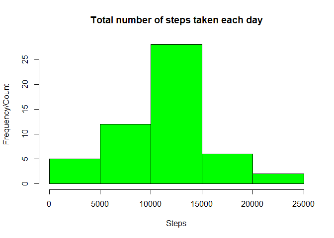
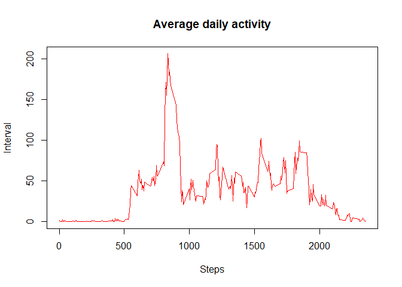
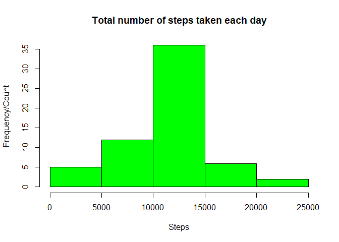

## Loading and preprocessing the data
Load data set from zip file and store into data_set variable


```r
data_set<-read.csv(unz("activity.zip", "activity.csv"),header = TRUE)
names(data_set)
```

```
## [1] "steps"    "date"     "interval"
```

```r
head(data_set)
```

```
##   steps       date interval
## 1    NA 2012-10-01        0
## 2    NA 2012-10-01        5
## 3    NA 2012-10-01       10
## 4    NA 2012-10-01       15
## 5    NA 2012-10-01       20
## 6    NA 2012-10-01       25
```

```r
summary(data_set)
```

```
##      steps                date          interval     
##  Min.   :  0.00   2012-10-01:  288   Min.   :   0.0  
##  1st Qu.:  0.00   2012-10-02:  288   1st Qu.: 588.8  
##  Median :  0.00   2012-10-03:  288   Median :1177.5  
##  Mean   : 37.38   2012-10-04:  288   Mean   :1177.5  
##  3rd Qu.: 12.00   2012-10-05:  288   3rd Qu.:1766.2  
##  Max.   :806.00   2012-10-06:  288   Max.   :2355.0  
##  NA's   :2304     (Other)   :15840
```

## What is mean total number of steps taken per day?

```r
#Steps taken per day - Filter and aggregate data excluding null
sub_set <- aggregate(steps~date,data = data_set,FUN = sum,na.rm = T)
head(sub_set)
```

```
##         date steps
## 1 2012-10-02   126
## 2 2012-10-03 11352
## 3 2012-10-04 12116
## 4 2012-10-05 13294
## 5 2012-10-06 15420
## 6 2012-10-07 11015
```

```r
# Histogram
hist(sub_set$steps,xlab="Steps",ylab = "Frequency/Count",main="Total number of steps taken each day",col="green")
```

<!-- -->

```r
#mean
mean(sub_set$steps)
```

```
## [1] 10766.19
```

```r
#median
median(sub_set$steps)
```

```
## [1] 10765
```


## What is the average daily activity pattern?

```r
#Avg daily activity - Filter and aggregate data excluding null
avg_set <- aggregate(steps~interval,data = data_set,FUN = mean,na.rm = T)
head(avg_set)
```

```
##   interval     steps
## 1        0 1.7169811
## 2        5 0.3396226
## 3       10 0.1320755
## 4       15 0.1509434
## 5       20 0.0754717
## 6       25 2.0943396
```

```r
plot(steps~interval,data=avg_set,type="l",xlab="Steps",ylab="Interval",col="red",main="Average daily activity")
```

<!-- -->

```r
#Interval maximum number of steps
avg_set$interval[which.max(avg_set$steps)]
```

```
## [1] 835
```


## Imputing missing values

```r
#Print missing steps
sum(is.na(data_set$steps)==TRUE)
```

```
## [1] 2304
```

```r
# calculate mean for each interval
x<-aggregate(steps~interval,data = data_set,FUN = mean,na.rm = T)

#Create function replace null with average value
NA_Replace <- function(step,avgval){
  if(is.na(step)==TRUE){
    return(avgval)
  }
  return(step)
}

#new updated data set

data_set$steps<-mapply(NA_Replace,data_set$steps, x$steps)
head(data_set)
```

```
##       steps       date interval
## 1 1.7169811 2012-10-01        0
## 2 0.3396226 2012-10-01        5
## 3 0.1320755 2012-10-01       10
## 4 0.1509434 2012-10-01       15
## 5 0.0754717 2012-10-01       20
## 6 2.0943396 2012-10-01       25
```

```r
#Steps taken per day - Filter and aggregate data excluding null
sub_set <- aggregate(steps~date,data = data_set,FUN = sum,na.rm = T)
head(sub_set)
```

```
##         date    steps
## 1 2012-10-01 10766.19
## 2 2012-10-02   126.00
## 3 2012-10-03 11352.00
## 4 2012-10-04 12116.00
## 5 2012-10-05 13294.00
## 6 2012-10-06 15420.00
```

```r
# Histogram
hist(sub_set$steps,xlab="Steps",ylab = "Frequency/Count",main="Total number of steps taken each day",col="green")
```

<!-- -->

```r
#mean
mean(sub_set$steps)
```

```
## [1] 10766.19
```

```r
#median
median(sub_set$steps)
```

```
## [1] 10766.19
```


## Are there differences in activity patterns between weekdays and weekends?
